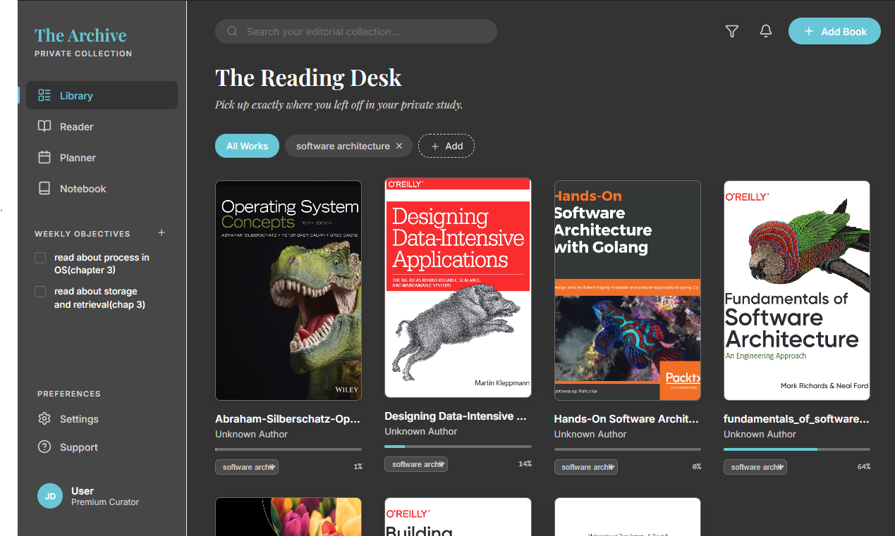
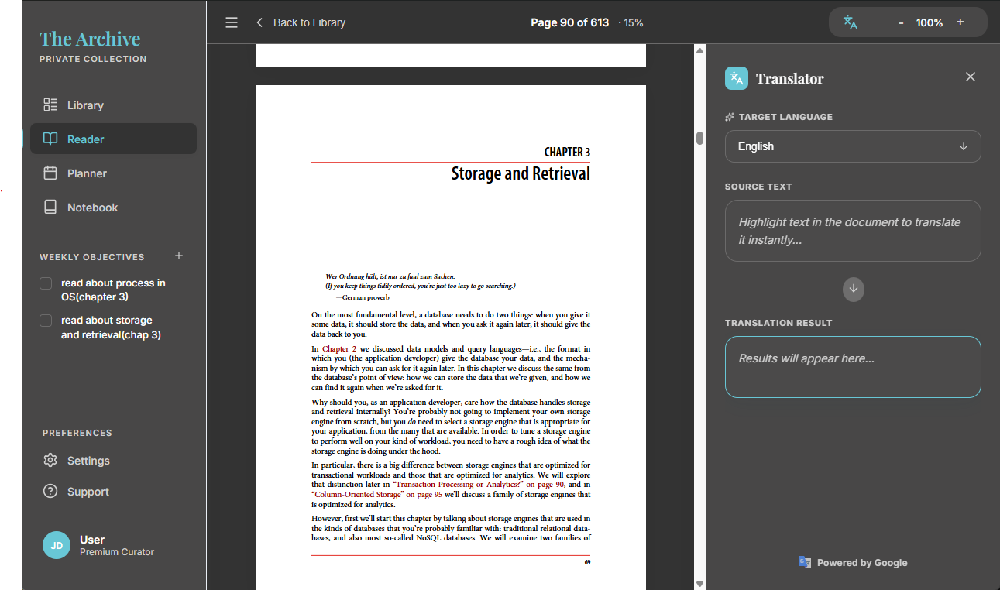

# README

## About

This is the official Wails React-TS template.

You can configure the project by editing `wails.json`. More information about the project settings can be found
here: https://wails.io/docs/reference/project-config

## Live Development

To run in live development mode, run `wails dev` in the project directory. This will run a Vite development
server that will provide very fast hot reload of your frontend changes. If you want to develop in a browser
and have access to your Go methods, there is also a dev server that runs on http://localhost:34115. Connect
to this in your browser, and you can call your Go code from devtools.

## Building

To build a redistributable, production mode package, use `wails build`.

## NOTE

This is a fully vibe coding project, the code is a mess, but it works.

## About the Project

This is a PDF reader application that allows you to read PDFs and keep track of your reading progress.

## Features

- Read PDFs
- Keep track of reading progress
- Set goals and track progress
- Translate text

## Tech Stack

- Wails
- React
- TypeScript
- Go

